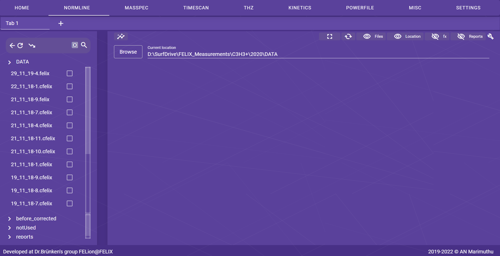

---
hide:
  - navigation
---

## General

The general page layout for __Normline__, __Masspec__, __Timescan__ and __THz__ are very similar such as to browse to the required location and select corresponding files types in `file-browser`.

<figure markdown>
  { align=left }
  <figcaption>Fig 2: The general page layout</figcaption>
</figure>

### File browser

As shown in Fig 2, the general layout with a `file-browser` column on the left and a `main-container` on the right typically consists of a split-screen interface. The `file-browser` column is typically a vertical column that takes up a portion of the left side of the screen. It displays a hierarchical tree structure of the files and directories on the computer or device, allowing the user to navigate through the file system and locate specific files.

The icons as shown in top-row of `file-browser` describes the following:

| Icons                 | Description  |
| -----------           | ------------ |
| :material-arrow-left: | navigate back   |
| :material-refresh:    | update and reload files in current location   |
| :material-trending-down:| sort files by name  |
| :material-select-all: | select all files  |
| :octicons-search-24:  | search to filter files  |

_Note: The `file-browser` only shows `file-types` corresponding to the current page and not all files available in the current location._

#### File types

Each page may use its own specific file types, and this information is provided in the following table.

| `file-type` (i.e., file extension) | Description  | Page |
| ----------------------- | ------------ | ------------ |
| _*.felix_  | FELIX IR-data  | Normline |
| _*.ofelix_ | OPO IR-data  | Normline |
| _*.mass_   | Masspectrum data  | Masspec |
| _*.scan_   | Timescan data  | Timescan |
| _*.thz_    | THz data  | THz |

### Main container

The `main-container` on the right takes up the remainder of the screen. The top row called `widget-row` consists of `icon-buttons` with function as described below:

| `icon-buttons` | Description |
| --- | --- |
| :material-fullscreen: | Full screen i.e., shows only plotted graphs |
| :material-cached: | Fix the plotted graph width to the available scrren width |
| :material-eye-outline: and :material-eye-off-outline: | toggle the visibility of labelled column from displaying |
| :octicons-tools-16: | pop-up modal with special elements which depends on selected page |

After the `icon-buttons` row, the next immediate row usually display additional information such as the location address, which shows the path to the current directory, and browse location buttons, which allow the user to navigate to different parts of the file system. This row is followed by additional row(s) depends on current active page. This entire collection of top row is referred as `initial-button-rows`.

Following `initial-button-rows`, the rest of the space of the  `main-container` include a display area for the selected file, controls for interacting with the plotted file data, and output areas for displaying the results of the processing or post-processing graph plots.
